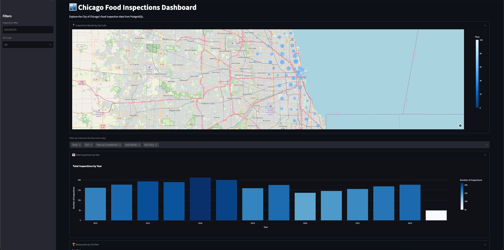

# Chicago Food Inspections Dashboard

## Project Overview

[This project provides an streamlit dashboard for analyzing food inspection data for the City of Chicago. An ETL (Extract, Transform, Load) pipeline fetches data from a public API from data.cityofchicago.org, processes and cleans it, and stores it in a PostgreSQL database. A Streamlit application then visualizes this data, allowing users to explore inspection trends, results, and common violations. The three major components are containerized collectively via Docker-Compose]


### API Used

*   **City of Chicago - Food Inspections API:** The data is sourced from the official City of Chicago Data Portal. The specific endpoint used is:
    `https://data.cityofchicago.org/resource/4ijn-s7e5.json`

## File Overview

*   ETL pipeline:
    *   Extract: Fetches data from the City of Chicago Food Inspections API (`extract.py`).
    *   Transform: Cleans, processes, and standardizes the raw data (`transform.py`).
    *   Load: Creates the schema and loads the transformed/cleaned data into a PostgreSQL database (`load.py`).

*   Streamlit Dashboard has dashboard wide filters for date and ZIP code.
*   Key visualizations:
    *   Geospatial map of inspection results by ZIP code.
    *   Trend of total inspections by year.
    *   Rankings of restaurants by their inspection fail rate.
    *   Distribution of overall inspection results (Pass, Fail, etc.) with a pie chart.
    *   Analysis of the most common inspection types.

## Running the Project with Docker Compose

Follow these instructions to run the project on your own machine.

### Prerequisites

*   [Docker Desktop](https://www.docker.com/get-started) installed and actively running.

### Step-by-Step Instructions

1.  **Clone the Repository:**
    Open your terminal or command prompt and clone this repository:
    ```bash
    git clone <your-github-repository-url>
    cd <repository-name>
    ```

2.  **Set Up Environment Configuration (`.env` file):**
    A sample file, `.env.sample`, is provided to show the required structure.

    *   Create your local environment file by copying the sample:
        ```bash
        cp .env.sample .env
        ```
    *   Open the new `.env` file created from the cp command in a text editor.
    *   The default values in the sample should function for everyone:
        ```dotenv
        DB_HOST=db
        DB_PORT=5432
        DB_NAME=inspections_db #change this if you want a different database name
        DB_USER=postgres
        DB_PASSWORD=your_own_password # Replace if you want a specific password for the DB container
        ```
        *   `DB_HOST`: Should remain `db`.
        *   `DB_PORT`: Should remain `5432`.

3.  **Build and Start Containers:**
    Navigate to the root directory of the cloned project (where the `docker-compose.yml` file is located). Run the following command in your terminal:
    ```bash
    docker-compose up --build
    ```

4.  **Accessing Services:**
    *   **Process:** You will see logs in your terminal from the `db-1` container as it sets up and configure the databse, the  `etl-1` container as it extracts, transforms, and loads data and lastly the `streamlit-1` container.

    *   **Streamlit Dashboard:** Once the `etl` container has finished and the `streamlit` container starts successfully, the dashboard will be accessible.
        Open your browser and navigate to:
        **[http://localhost:8501]**

        The streamlit container will by default show a link at its completion 0.0.0.0:8501 this link will likely not work, the localhost link above is prefered and will function as intended

### PostgreSQL Setup Description

*   The `docker-compose.yml` file defines a hot named `db` using the official `postgres:14` Docker image.
*   Environment variables from the `.env` file (`DB_USER`, `DB_PASSWORD`, `DB_NAME`,`DB_HOST` ) are used to configure the PostgreSQL instance when it first initializes.

*   **the `load.py` script in the ETL pipeline contains the schema for the inspections table and is also designed to `DROP` and `CREATE` the `inspections` table each time the ETL runs. This ensures that even if data exists from a previous run, you start with an empty table state for each full ETL cycle.**

## Screenshot of the Streamlit Dashboard



## Run Behavior Summary

Executing `docker-compose up --build` ->

1.  The PostgreSQL container (`db`) starts. If it's the first run or the data volume is empty, it initializes a new database.

2.  The ETL container (`etl`) starts after the database is ready.
    *   It executes `extract.py` to fetch data from the API.
    *   then runs `transform.py` to use cleaning functions.
    *   then `load.py`, which drops the `inspections` table if it exists to prevent any posible issues then recreates the `inspections` table schema, and loads the cleaned data.

3.  Once the `etl` container completes, the Streamlit container starts and the localhost link to view the dashboard is functional.


## Team Members and Contributions

*   **Munish Shah:** Streamlit visualizations, Docker setup, PostgreSQL schema, extracting from API, Data Cleaning (City names, liscence_, dba and aka name)
*   **Jaslyne Meriales:** Data Cleaning, Creating Schema, Streamlit Visualizations
*   **Emily Juarez:** Violation cleaning, facility_type cleaning, latitude and longitude cleaning, Streamlit visualizations
*   **Naomi Rhoe:** Data Cleaning, Streamlit Visualizations

---